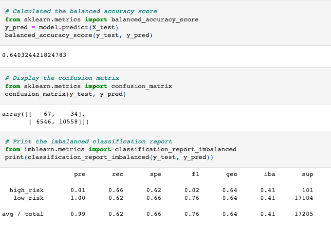
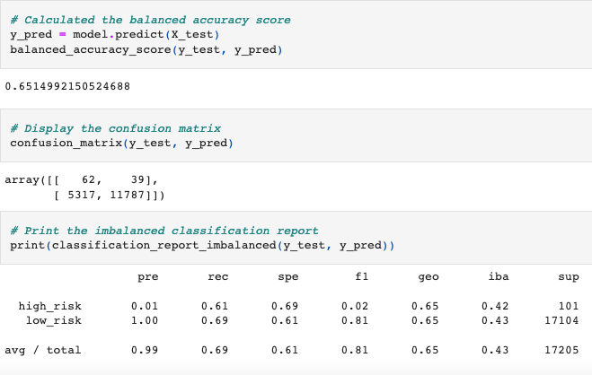
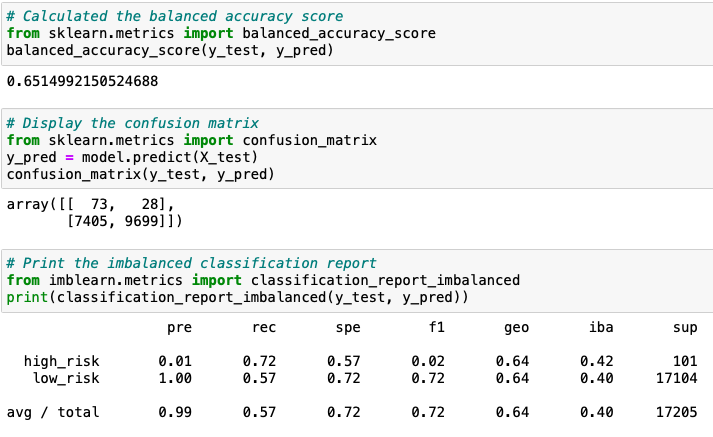
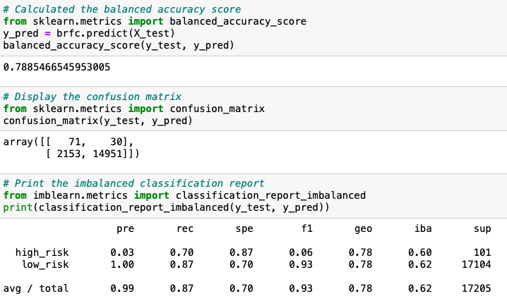
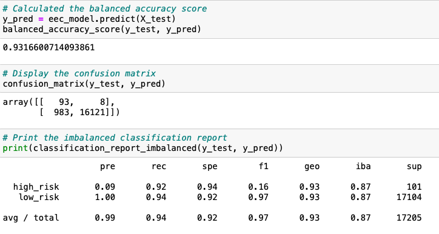

# Credit Risk Analysis
## Over of the analysis
The purpose of this analysis was to use six machine learning models to predict credit card risk. Using imbalanced-learn and scikit-learn libaries to build and evaluate models using resampling. The next part of the challenge was to use RandomOverSample SMOTE algorithms, and undersample the data using the ClusterCentroids algorithm. And to finalize the results BalancedRandomForestClassifier and EasyEnsembleClassifier was used to compare the two maching learning models.

## Results
- Naive Oversampling

- SMOTE Oversampling

- Undersampling with Cluster Centroids

- SMOTEENN

- Balanced Random Forest Classifier

- Easy Ensemble

## Summary
After testing all six model Easy Ensemble Classifer had the greatest results with an accuracy of 93% and a 9% precision rate for high risk. Low risk unfortunately had low precision scores this showed that low risk credits shown as high risk.
